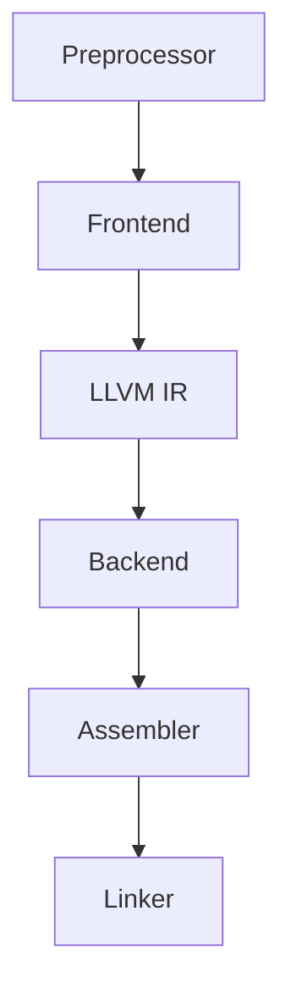

_Clang_ adalah _driver_ yang menjalankan kode sumber lewat tahap-tahap berikut. Kita bisa berhenti di tiap tahap untuk melihat _output_-nya dengan _flag_ yang sesuai.



Contoh kode yang dipakai di perintah-perintah berikut:

```c
// hello.c
#include <stdio.h>

int main() {
  printf("Hello World!\n");
  return 0;
}
```

## Output Preprocessor

```bash
clang -E hello.c -o hello.i
```

```text
CLANG via C v22.1.6-clang
❯ cat hello.i
# 1 "hello.c"
# 1 "<built-in>" 1
# 1 "<built-in>" 3
# 472 "<built-in>" 3
# 1 "<command line>" 1
# 1 "<built-in>" 2
# 1 "hello.c" 2
# 1 "/Library/Developer/CommandLineTools/SDKs/MacOSX26.sdk/usr/include/stdio.h" 1 3 4
# 61 "/Library/Developer/CommandLineTools/SDKs/MacOSX26.sdk/usr/include/stdio.h" 3 4
[... dipotong, ratusan baris hasil ekspansi header ...]
# 2 "hello.c" 2

int main() {
  printf("Hello World!\n");
  return 0;
}
```

## LLVM IR

```bash
clang -S -emit-llvm hello.c -o hello.ll
```

```text
CLANG via C v22.1.6-clang
❯ cat hello.ll
; ModuleID = 'hello.c'
source_filename = "hello.c"
target datalayout = "e-m:o-p270:32:32-p271:32:32-p272:64:64-i64:64-i128:128-n32:64-S128-Fn32"
target triple = "arm64-apple-macosx26.0.0"

@.str = private unnamed_addr constant [14 x i8] c"Hello World!\0A\00", align 1

; Function Attrs: noinline nounwind optnone ssp uwtable(sync)
define i32 @main() #0 {
  %1 = alloca i32, align 4
  store i32 0, ptr %1, align 4
  %2 = call i32 (ptr, ...) @printf(ptr noundef @.str)
  ret i32 0
}

declare i32 @printf(ptr noundef, ...) #1
[... dipotong, atribut dan metadata ...]
```

## Assembly

```bash
clang -S hello.c -o hello.s
```

```text
CLANG via C v22.1.6-clang
❯ cat hello.s
        .build_version macos, 26, 0     sdk_version 26, 2
        .section        __TEXT,__text,regular,pure_instructions
        .globl  _main                           ; -- Begin function main
        .p2align        2
_main:                                  ; @main
        .cfi_startproc
; %bb.0:
        sub     sp, sp, #32
        stp     x29, x30, [sp, #16]             ; 16-byte Folded Spill
        add     x29, sp, #16
        .cfi_def_cfa w29, 16
        .cfi_offset w30, -8
        .cfi_offset w29, -16
        mov     w8, #0                          ; =0x0
        str     w8, [sp, #8]                    ; 4-byte Spill
        stur    wzr, [x29, #-4]
        adrp    x0, l_.str@PAGE
        add     x0, x0, l_.str@PAGEOFF
        bl      _printf
        ldr     w0, [sp, #8]                    ; 4-byte Reload
        ldp     x29, x30, [sp, #16]             ; 16-byte Folded Reload
        add     sp, sp, #32
        ret
        .cfi_endproc
                                        ; -- End function
        .section        __TEXT,__cstring,cstring_literals
l_.str:                                 ; @.str
        .asciz  "Hello World!\n"

.subsections_via_symbols
```

## Object File

```bash
clang -c hello.c -o hello.o
```

```text
CLANG via C v22.1.6-clang
❯ llvm-objdump -d hello.o

hello.o:        file format mach-o arm64

Disassembly of section __TEXT,__text:

0000000000000000 <ltmp0>:
       0: d10083ff      sub     sp, sp, #0x20
       4: a9017bfd      stp     x29, x30, [sp, #0x10]
       8: 910043fd      add     x29, sp, #0x10
       c: 52800008      mov     w8, #0x0                ; =0
      10: b9000be8      str     w8, [sp, #0x8]
      14: b81fc3bf      stur    wzr, [x29, #-0x4]
      18: 90000000      adrp    x0, 0x0 <ltmp0>
      1c: 91000000      add     x0, x0, #0x0
      20: 94000000      bl      0x20 <ltmp0+0x20>
      24: b9400be0      ldr     w0, [sp, #0x8]
      28: a9417bfd      ldp     x29, x30, [sp, #0x10]
      2c: 910083ff      add     sp, sp, #0x20
      30: d65f03c0      ret
```

## Executable Hasil Link

```bash
clang hello.c -o hello
```

```text
CLANG via C v22.1.6-clang
❯ llvm-objdump -d hello

hello:  file format mach-o arm64

Disassembly of section __TEXT,__text:

0000000100000460 <_main>:
100000460: d10083ff     sub     sp, sp, #0x20
100000464: a9017bfd     stp     x29, x30, [sp, #0x10]
100000468: 910043fd     add     x29, sp, #0x10
10000046c: 52800008     mov     w8, #0x0                ; =0
100000470: b9000be8     str     w8, [sp, #0x8]
100000474: b81fc3bf     stur    wzr, [x29, #-0x4]
100000478: 90000000     adrp    x0, 0x100000000 <_printf+0x100000000>
10000047c: 91128000     add     x0, x0, #0x4a0
100000480: 94000005     bl      0x100000494 <_printf+0x100000494>
100000484: b9400be0     ldr     w0, [sp, #0x8]
100000488: a9417bfd     ldp     x29, x30, [sp, #0x10]
10000048c: 910083ff     add     sp, sp, #0x20
100000490: d65f03c0     ret

Disassembly of section __TEXT,__stubs:

0000000100000494 <__stubs>:
100000494: 90000030     adrp    x16, 0x100004000 <_printf+0x100004000>
100000498: f9400210     ldr     x16, [x16]
10000049c: d61f0200     br      x16
```

## Lihat Semua Tahap

```bash
clang -ccc-print-phases hello.c
```

```text
CLANG via C v22.1.6-clang
❯ clang -ccc-print-phases hello.c
               +- 0: input, "hello.c", c
            +- 1: preprocessor, {0}, cpp-output
         +- 2: compiler, {1}, ir
      +- 3: backend, {2}, assembler
   +- 4: assembler, {3}, object
+- 5: linker, {4}, image
6: bind-arch, "arm64", {5}, image
```

## Lihat Perintah yang Dipanggil

```bash
clang -v hello.c
```

```text
CLANG via C v22.1.6-clang
❯ clang -v hello.c
Homebrew clang version 22.1.6
Target: arm64-apple-darwin25.5.0
Thread model: posix
InstalledDir: /opt/homebrew/Cellar/llvm/22.1.6/bin
Configuration file: /opt/homebrew/Cellar/llvm/22.1.6/etc/clang/arm64-apple-darwin25.cfg
System configuration file directory: /opt/homebrew/Cellar/llvm/22.1.6/etc/clang
User configuration file directory: /Users/jefrydco/.config/clang
 "/opt/homebrew/Cellar/llvm/22.1.6/bin/clang-22" -cc1 -triple arm64-apple-macosx26.0.0 [... dipotong, banyak flag -target-feature ...] -o /var/folders/8n/.../hello.o -x c hello.c
clang -cc1 version 22.1.6 based upon LLVM 22.1.6 default target arm64-apple-darwin25.5.0
```
